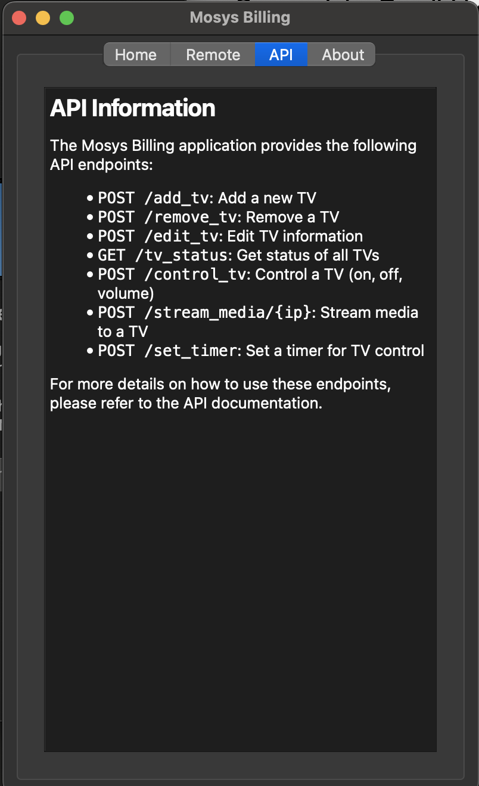
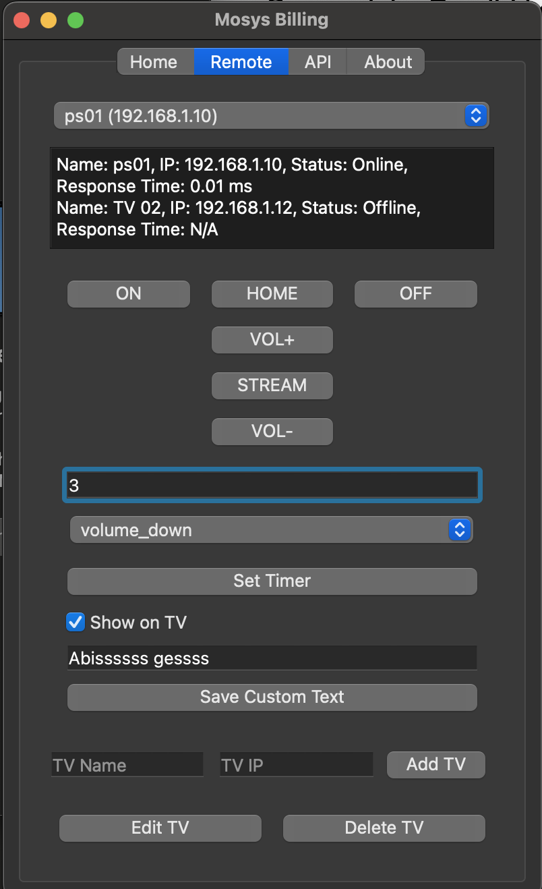

```markdown
# Mosys Billing

Mosys Billing is a desktop application that allows users to control smart TVs using a graphical user interface (GUI). The application provides functionalities such as adding TVs, controlling their power state, adjusting volume, streaming media, and setting timers.

## Features

- **Add and Remove TVs**: Easily manage your list of TVs by adding or removing them.
- **Control TV Functions**: Control power, volume, and other functions directly from the application.
- **Stream Media**: Stream media files to your TV.
- **Set Timers**: Set timers for various actions on the TV.
- **Custom Messages**: Display custom messages on the TV when the timer expires.

## Screenshots

### Home Screen


### Remote Control Screen


## Requirements

- Python 3.6 or higher
- Flask
- PyQt5
- ping3
- requests

## Installation

1. Clone the repository:

   ```bash
   git clone https://github.com/yourusername/mosys-billing.git
   cd mosys-billing
   ```

2. Create a virtual environment (optional but recommended):

   ```bash
   python -m venv venv
   source venv/bin/activate  # On Windows use `venv\Scripts\activate`
   ```

3. Install the required packages:

   ```bash
   pip install -r requirements.txt
   ```

## Usage

1. Start the application:

   ```bash
   python main.py
   ```

2. Use the GUI to manage your TVs and control their functions.

## API Endpoints

The application provides the following API endpoints:

- `POST /add_tv`: Add a new TV.
- `POST /remove_tv`: Remove a TV.
- `POST /edit_tv`: Edit TV information.
- `GET /tv_status`: Get the status of all TVs.
- `POST /control_tv`: Control a TV (on, off, volume).
- `POST /stream_media/{ip}`: Stream media to a TV.
- `POST /set_timer`: Set a timer for TV control.

## Contributing

Contributions are welcome! Please open an issue or submit a pull request for any improvements or bug fixes.

## License

This project is licensed under the MIT License - see the [LICENSE](LICENSE) file for details.

## Contact

For any inquiries, please contact:

- **Developer**: Kurniawan
- **Instagram**: [@sedotphp](https://instagram.com/sedotphp)
- **Website**: [sedot.dev](https://sedot.dev)
- **Contact Number**: 081373350813
```

### Explanation of the Added Sections

- **Screenshots**: This section includes two images:
  - **Home Screen**: Displays the main interface of the application.
  - **Remote Control Screen**: Shows the remote control functionalities.

### Image Placement

- Make sure to place the `home.png` and `remote.png` images in the same directory as your `README.md` file, or adjust the paths accordingly if they are located in a different folder.

### Final Note

Feel free to modify the text or add more screenshots as needed! If you have any other requests or need further assistance, let me know!